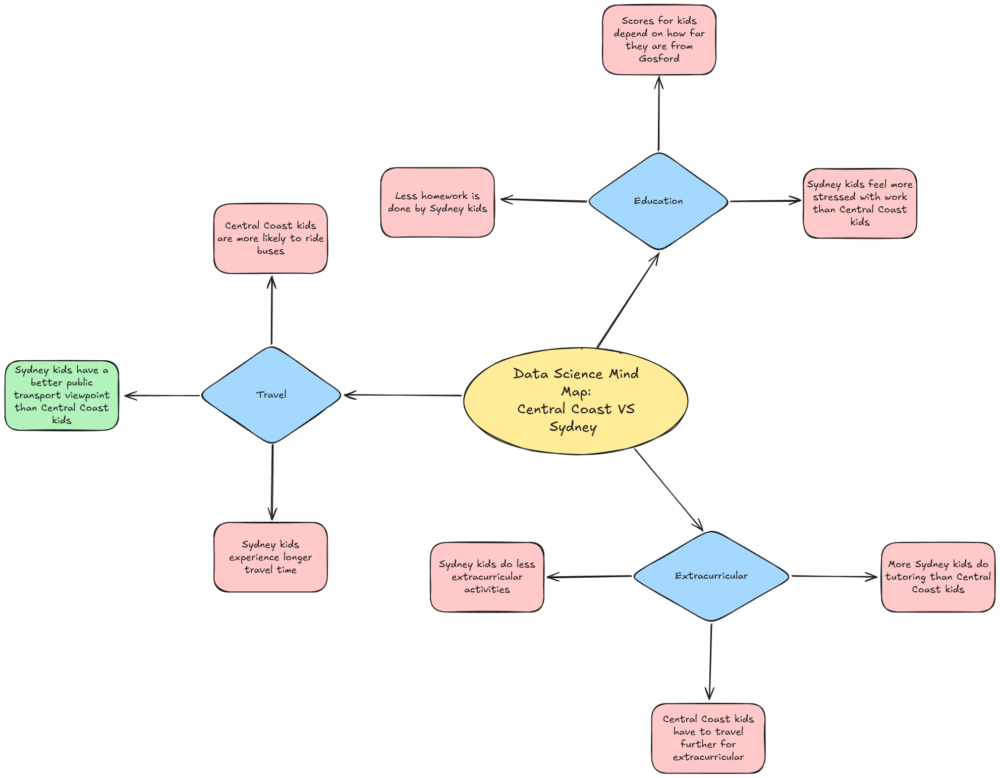

# Year 9 Data Analysis Assessment

## Identifying and Defining

### Mind Map: 

### Hypothesis:
People living in Sydney have a more positive viewpoint of Public Transport than Central Coast/Newcastle does.

### Requirements - 
#### Functional: 
The system must be able to maintain an Excel or Sheets spreadsheet. It also must be able to load data through correct format. This system won't need filtering and sorting since it will take the form of a survey. A mean is required for the hypothesis to be answered (figuring out who has the higher mean when it comes to a viewpoint) but a code to add tables of data together and create a rating will also be required. Optional additions can be median and mode (for extra analysis and patterns). The data will be visualised through Matplotlib (with a representation of all of the factors such as Reliability of Transport) and a table comparing different results (such as how many good ratings also catch a train). The system's output should be stored in a .csv file.

#### Non-Functional:  
The User Interface needs to be easily readable, including colour for extra understanding and allowing the README to be accessed from the home menu. To avoid error and maintain reliability with the system I will test the system to its limit to make sure that it cannot be broken or data can't be breached.

#### Use-Case:
Actor: User

Goal: To access and interact with surveyed data through an easy-to-understand user interface.

Preconditions: 
- A survey must be created outlining the factors
- The survey must be answered by a substantial amount of people for maximum accuracy

Main Flow:
1. The user opens the system to the main menu
2. The user is given a choice between: 
    - Accessing the README File
    - Accessing the raw data
    - Viewing visualisation in table and graph format
    - Searching for a specific piece of data
    - Accessing the mean, median, mode and ranges of the data
3. The system performs the action without mistake

Postconditions:
- User has viewed and interacted with data
- Data remains available after use\

## Researching and Planning

### Research & Findings:
Since this is a survey-based analysis, not as much analysis can be gained for the chosen topic of Central Coast VS Sydney Transport Appreciation. However, I was able to get a few early looks into what people's ideas are through the release of a survey, to the class for now.

As of now, it seems that out of the 3 Sydney and 8 Central Coast respondants, Sydney is surprisingly giving a lower appreciation. Nearly every Central Coast respondant gave a good score for overall transport while Sydney's highest was a 5/10, mediocre at best. While it is too early to tell the final results, there are some patterns in the data that give this scenario more sense. Sydney kids have more avaliability for public transport near them, so it could be a case of taking it for granted. However, every kid also takes up to an hour just to get to Gosford. Prolonged time on transport in other scenarios increases the likelihood of unreliability somewhere. Though this will only be a fraction of the total end data, it begins to paint a picture of the patterns that shape how the analysis will go.

### Data Dictionary:
| Field | Datatype | Display Format | Description | Example | Validation 
| - | - | - | - |- | - |
| location | object | AAA | What area the user is located in | SYD | Must be 3 letters, only 3 options |
| train_reliable | integer64 | N | The user's rating out of 5 for trains | 4 | Must be integer from 1 - 5 |
| bus_reliable | integer64 | N | The user's rating out of 5 for buses | 2 | Must be integer from 1 - 5 |
| other_transport | object | AA...AA | If the user catches other transport | Ferry - Useful | Will state 'N/A' if nothing |
| often_transport | object | NN - NN  or +- NN | How often the user's transport is | 15 - 30 min | Out of 5 strings |
| time_transport | object | NN - NN or +- NN | How long a user's travel time is | + 60 min | Out of 5 strings |
| word_transport | object | AA...AA | A word by the user to describe transport | Good | Any amount of words, no integers |
| transport_rating | integer64 | N | The user's rating out of 10 for transport overall | 8 | Must be integer from 1 - 10 |

## Prodicing and Implementing

### Earlier Commits
Commit 5638f52 - Made a start on the Identifying and Defining section.

Commit 741c03e - Added Research and Planning title screens.

Commit 4f6c6f7 - Began work on the data dictionary.

Commit 0999397 - Finished the data dictionary and added the PublicTransportViewpoint_csv file

Commit 1466302 - Created the main menu user interface

Commit 60f2fa2 - Added the data_module python file

Commit 5818901 - Added Research paragraphs to the Research and Planning section

Commit 6ca7fab - Updated the PublicTransportViewpoint_csv file with more entries

Commit c49c860 - Added the show_tables menu screen.

Commit 4d35bac - Updated the csv file again and finished the show_tables function.

Commit 31f4159 - Updated the csv file for the second last time and fixed the show_tables functuon.

Commit 7804606 - Added spacing to functions and files.

Commit 28763f3 - Implemented a .json file.

Commit 71f0fb7 - Updated csv file for the last time and made sure current code runs smoothly.

### README document
To understand how the analysis works, use the README file.